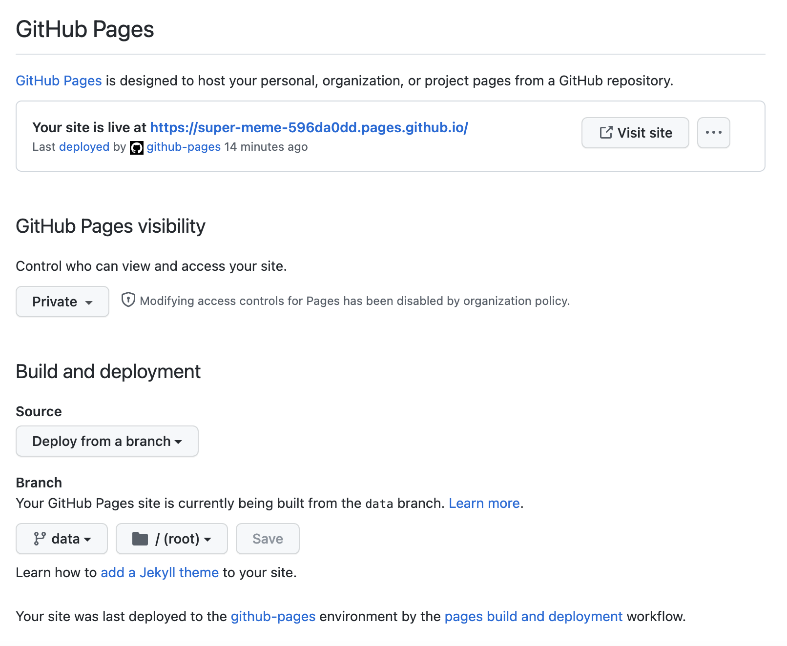

# Setup Guide
codecrew is designed to be easy to setup & completely run inside your Github.  

Once you've completed this short setup guide (~5min) you won't have to touch codecrew anymore - it should all happen automatically through scheduled Github Actions.  

# Github Pages
To host codecrew **privately** inside your Github organization, active Github pages:
1. Go to codecrew fork > Settings > Pages
2. Set visibility to **Private** (you don't want your software developers skills + emails out there for headhunters to grab, do you?)
3. Set branch to **data** (if you don't see it yet, please wait for the data-pipeline to run through successfully at least once - it will create an empty data branch)
4. Press save

